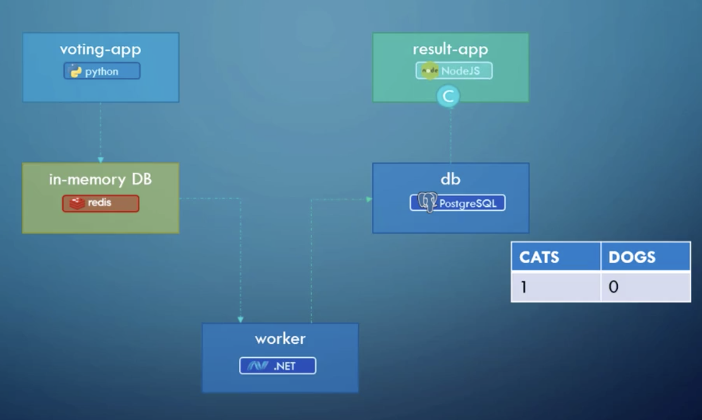

# Kubernetes Voting App

Simple example of the kubernetes voting app (version 1). The main purpose of this repository
is (for me) to learn how things work in kubernetes ecosystem. There are some notes in
[notes.md](notes.md) file which might be useful. Atm the topics are a bit mixed because
I have some notes written in my handbook (the old way) and I didn't want to duplicate the
content. I will try to move everything online with images so that everyone can use it
(no promises :smile:).

# Prerequisites

You need to install the following:
- [VirtualBox](https://www.virtualbox.org/wiki/Downloads) - virtualization tool.
- [kubectl](https://kubernetes.io/docs/tasks/tools/install-kubectl/) - k8s command-line tool.

In order to make this tutorial (or whatever you want to call it) as simple as possible
we will use just one k8s platform - [GCP](https://cloud.google.com/kubernetes-engine/docs/).

You can also use:
  - [Minikube](https://kubernetes.io/docs/setup/minikube/) to run it locally but it requires you to install minikube first.
  - [AWS](https://aws.amazon.com/eks/)
  - [DigitalOcean](https://www.digitalocean.com/products/kubernetes/) (very easy to setup but not as powerful as as GCP)

So first you need to have a Google account and have billing enabled for GCP (yes, it
will cost a few $ to play with k8s on GCP). Then you will need (recommended) to install
[Google Cloud SDK](https://cloud.google.com/sdk/docs/quickstart-macos) - `gcloud` tool.
This will allow you to configure `kubectl` with one command which you will copy&paste
from the GCP kubernetes dashboard. It will look something like this:

```
$ gcloud container clusters get-credentials standard-cluster-1 --zone us-central1-a --project MYPROJECT-123456
```

After this commands like `kubectl get pods` will work because `.kube/config` file will
be created and it will point to GCP k8s cluster.


## Create a cluster

Ok now we are ready to create our cluster. This is super easy on GCP so I won't go into
it. Just follow this [instructions](https://kubernetes.io/docs/setup/turnkey/gce/).

## Deploy the app

We will use [Docker simple voting app example](https://github.com/dockersamples/example-voting-app)
for our use case. The voting app consist of 5 parts:

1. Frontend Voting App - Python
1. Frontend Result App - NodeJS
1. Worker App - .NET
1. Redis
1. PostgreSQL


_This screenshot is taken from [Mumshad Mannambeth](https://github.com/mmumshad) course on udemy - [Kubernetes for the Absolute Beginners](https://www.udemy.com/learn-kubernetes/learn/v4/content)_

So now we have a running cluster and the only thing that we need to do is to deploy
the app - `voting-app-v1`. In order to do this we need to deploy 5 [Pods](https://kubernetes.io/docs/concepts/workloads/pods/pod/):

1. [postgres-pod.yaml](pods/postgres-pod.yaml): `kubectl create -f pods/postgres-pod.yaml`
1. [redis-pod.yaml](pods/redis-pod.yaml): `kubectl create -f pods/redis-pod.yaml`
1. [result-app-pod.yaml](pods/result-app-pod.yaml): `kubectl create -f pods/result-app-pod.yaml`
1. [voting-app-pod.yaml](pods/voting-app-pod.yaml): `kubectl create -f pods/voting-app-pod.yaml`
1. [worker-app-pod.yaml](pods/worker-app-pod.yaml): `kubectl create -f pods/worker-app-pod.yaml`

But this pods are just containers (kinda) that are floating inside nodes. We need to
connect them because they need to be able to communicate with each other. E.g. Frontend
Voting App needs to talk with Redis. [`Services`](https://kubernetes.io/docs/concepts/services-networking/service/)
solve this problem.

We need 4 services for our Pods:

1. [postgres-service.yaml](services/postgres-service.yaml): `kubectl create -f services/postgres-service.yaml` - it will expose port 5432 (default postgres port) to the internal cluster network.
1. [redis-service.yaml](services/redis-service.yaml): `kubectl create -f services/redis-service.yaml` - it will expose port 6379 (default redis port) to the internal cluster network.
1. [result-service.yaml](services/result-service.yaml): `kubectl create -f services/result-service.yaml` - it will expose result app on port 80 to external IP via load balancer.
1. [voting-service.yaml](services/voting-service.yaml): `kubectl create -f services/voting-service.yaml` - it will expose voting app on port 80 to external IP via load balancer.

And this is it. Type `kubectl get services` to see which external IP has GCP assigned
to voting and result service and then just open those pages in your web-browser.
